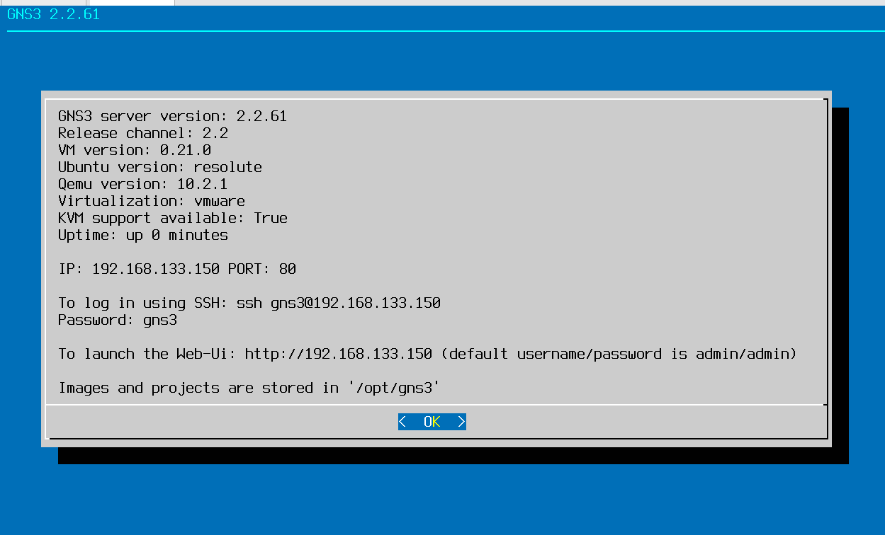
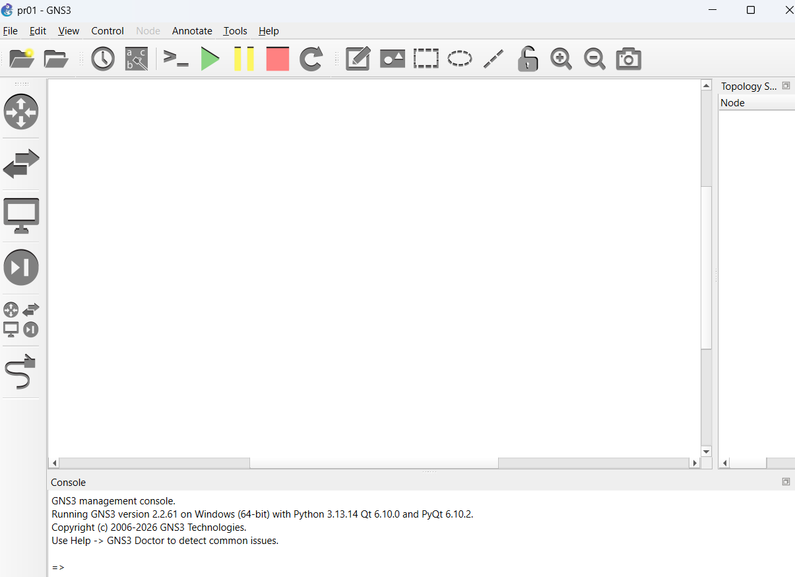
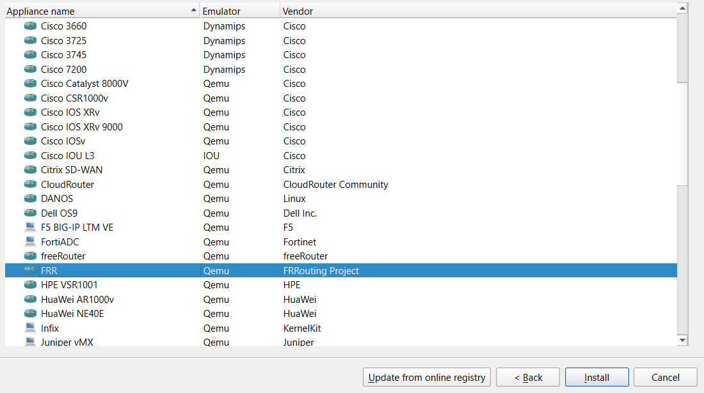
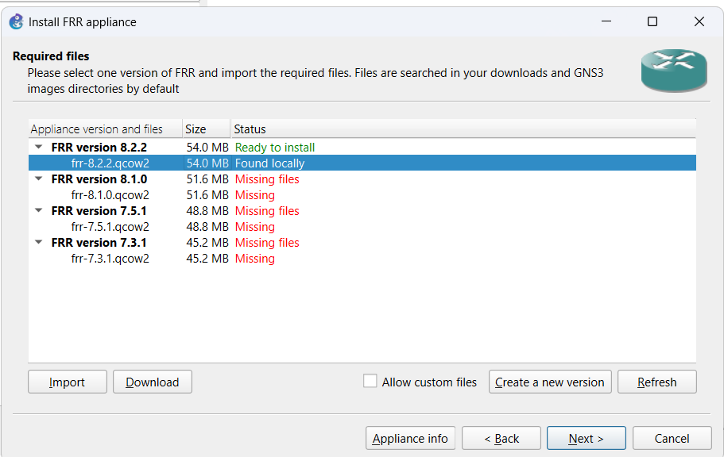
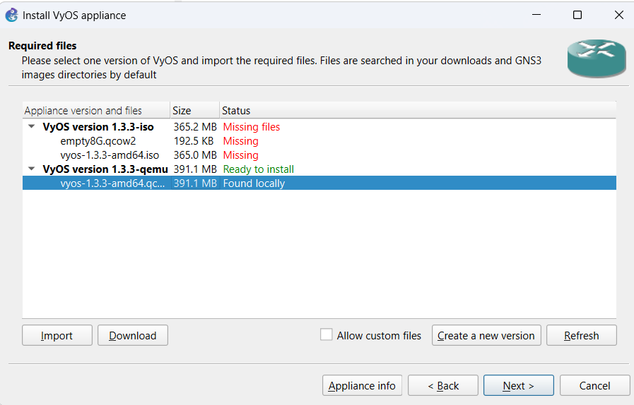
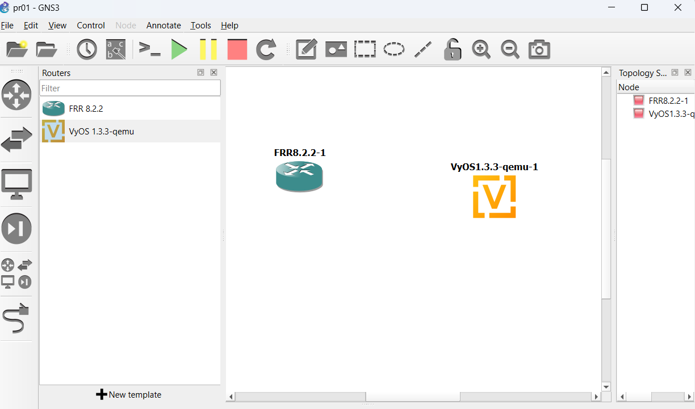
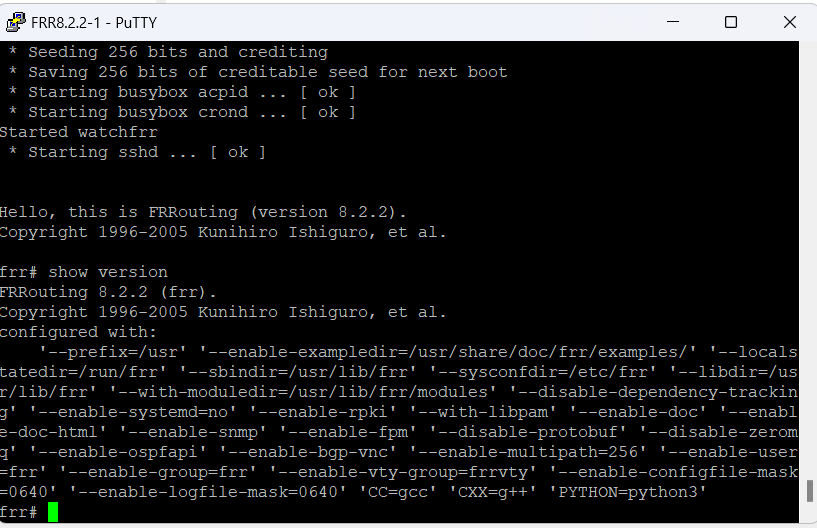
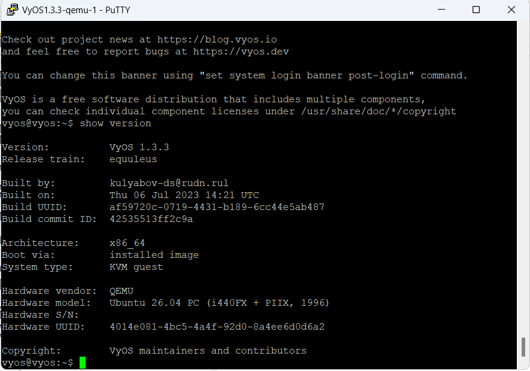

---
## Author
author:
  name: Саенко Анна Андреевна
  email: 1132246833@rudn.ru
  affiliation:
    - name: Российский университет дружбы народов
      country: Российская Федерация
      postal-code: 117198
      city: Москва
      address: ул. Миклухо-Маклая, д. 6

## Title
title: Лабораторная работа №1
subtitle: Подготовка экспериментального стенда GNS3
license: CC BY
date: today
date-format: "YYYY-MM-DD"
---

# Цели и задачи работы

## Цель лабораторной работы

Целью лабораторной работы является установка GNS3, настройка GNS3 VM, импорт образов маршрутизаторов FRR и VyOS, а также проверка их работоспособности.

## Задачи лабораторной работы

- установить GNS3-all-in-one;
- установить и запустить GNS3 VM;
- проверить корректность запуска GNS3;
- импортировать образ маршрутизатора `FRR`;
- импортировать образ маршрутизатора `VyOS`;
- проверить работу маршрутизаторов FRR и VyOS.

# Процесс выполнения лабораторной работы

## Проверка запуска GNS3 VM

После запуска GNS3 VM проверена информация о сервере GNS3. В консоли отображается версия `2.2.61`, IP-адрес виртуальной машины и параметры доступа.

{ #fig:001 width=70% height=70% }

## Запуск графического интерфейса GNS3

Запущен графический интерфейс GNS3 в Windows. В консоли управления отображается информация о версии GNS3 и успешном запуске приложения.

{ #fig:002 width=70% height=70% }

## Выбор шаблона FRR

В мастере добавления нового устройства выбран маршрутизатор `FRR`, работающий через эмулятор `Qemu`.

{ #fig:003 width=70% height=70% }

## Импорт образа FRR

Для маршрутизатора FRR выбран образ `frr-8.2.2.qcow2`. Файл найден локально, а версия `FRR 8.2.2` получила состояние `Ready to install`.

{ #fig:004 width=70% height=70% }

## Импорт образа VyOS

Для маршрутизатора VyOS выбран образ `vyos-1.3.3-amd64.qcow2`. Образ найден локально и подготовлен к установке.

{ #fig:005 width=70% height=70% }

## Добавление маршрутизаторов в проект

После импорта маршрутизаторы `FRR 8.2.2` и `VyOS 1.3.3-qemu` добавлены на рабочую область проекта GNS3.

{ #fig:006 width=70% height=70% }

## Проверка маршрутизатора FRR

Для проверки работы FRR выполнена команда `show version`. В выводе отображается версия `FRRouting 8.2.2`, что подтверждает корректный запуск устройства.

{ #fig:007 width=70% height=70% }

## Проверка маршрутизатора VyOS

Для проверки работы VyOS выполнена команда `show version`. В выводе отображается версия `VyOS 1.3.3`, архитектура `x86_64` и тип системы `KVM guest`.

{ #fig:008 width=70% height=70% }

# Результаты работы

## Полученные результаты

В ходе выполнения лабораторной работы были установлены и проверены компоненты GNS3.

Были выполнены следующие действия:

- установлен и запущен GNS3;
- запущена виртуальная машина GNS3 VM;
- проверено подключение к GNS3 VM;
- импортирован маршрутизатор `FRR 8.2.2`;
- импортирован маршрутизатор `VyOS 1.3.3`;
- оба маршрутизатора добавлены в проект;
- выполнена проверка версий FRR и VyOS.

## Вывод

В ходе лабораторной работы были установлены и проверены GNS3 и GNS3 VM.

В среду GNS3 были импортированы образы маршрутизаторов FRR и VyOS. После запуска устройств была выполнена проверка их версий с помощью команды `show version`. Оба маршрутизатора работают корректно.